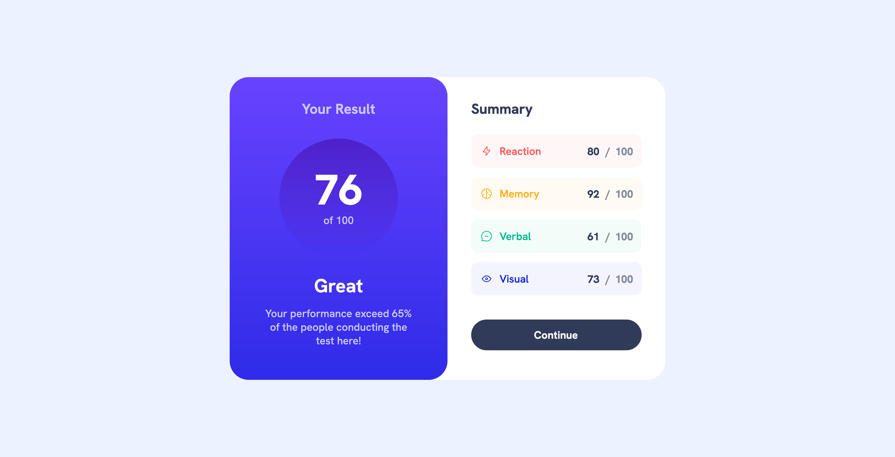

# Frontend Mentor - Results summary component solution

This is a solution to the [Results summary component challenge on Frontend Mentor](https://www.frontendmentor.io/challenges/results-summary-component-CE_K6s0maV).

## Table of contents

- [Overview](#overview)
  - [The challenge](#the-challenge)
  - [Screenshot](#screenshot)
  - [Links](#links)
- [My process](#my-process)
  - [Built with](#built-with)
- [Author](#author)
- [Acknowledgments](#acknowledgments)

## Overview

This repository contains my solution to the Results summary component challenge on Frontend Mentor. The challenge required the creation of a responsive web page that displays the results of a survey, including a summary section and a detailed section with information about the survey results.

In this project, I used HTML, SASS and BEM to build a web page that meets the requirements of the challenge, using responsive design techniques to ensure that the page looks good on all devices.

### The challenge

Users should be able to:

- View the optimal layout for the interface depending on their device's screen size
- See hover and focus states for all interactive elements on the page

### Screenshot

### Links

- Live Site URL: [Add live site URL here](https://dee-diaz.github.io/results-summary-component/)

## My process

1. Set up a basic HTML file with the necessary structure for the landing page.

2. Wrote the CSS styles using SASS, which is a CSS preprocessor that makes it easier to write complex stylesheets. SASS allows you to use variables, mixins, and functions, which can simplify the process of writing CSS.

3. Used BEM methodology to structure the CSS. BEM stands for Block Element Modifier and is a naming convention for CSS classes that makes it easier to manage and scale large CSS projects. BEM encourages the use of modular, reusable code and helps to avoid specificity issues.

4. Compiled the SASS code into CSS using a SASS compiler.

5. Linked the compiled CSS file to the HTML file.

6. Tested the landing page to make sure it displays correctly in different browsers and devices.

### Built with

- Semantic HTML5 markup
- SASS
- Flexbox
- BEM
- Desktop-first workflow
